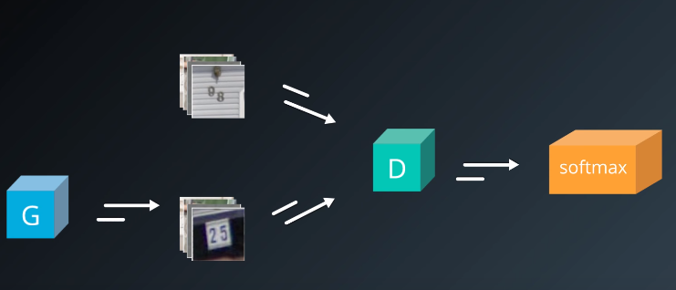
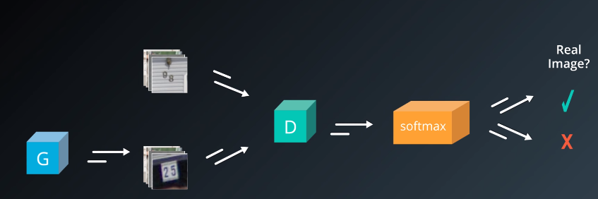
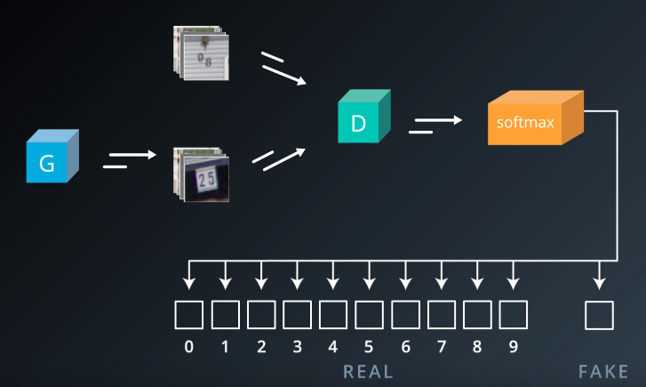

# Semi-Supervised Learning with GANs

Semi-Supervised Learning: Model can learn using both labeled and unlabeled data

* Unlabeled data is easier to obtain

## Use GAN for Classification

* Discriminator network is used as a classifier
  * Can learn from:
    * Real labeled images
    * Real unlabeled images
    * Fake images
  * Gives a large amount of inputs without needing all to be labeled
* Generator network is of secondary importance:

  * Used to train the Discriminator network.

* Normal classifier networks can only train using Labeled Images
* Semi-Supervised GAN can train using labeled, unlabeled and fake generated images

### Discriminator as Classifier

* GAN discriminator normally has sigmoid output
  * Binary output -> fake or real
    
* Change discriminator sigmoid output to a **softmax** output
  
* Split 'real' class into all different classes to recognize
* Keep single class for all fake images

  * Example for recognizing digits 0-9 for SVHN street numbers:

    

Training Cost:

* Total cost is now sum of labeled cost and unlabeled cost
* Labeled cost is cross entropy of the discriminator logits and the labels
* Unlabeled cost is cross entropy of discriminator logits and GAN cost
* Probability that input is real is sum of probability over real classes

```
total_cost = cost_labeled + cost_unlabeled
cost_labeled = cross_entropy(logits, labels)
cost_unlabeled = cross_entropy(logits, real)
p_real = sum(softmax(real_classes))
```

### Feature Matching

Add a term to the cost function for the generator penalizing the mean absolute error between the average value of some set of features on the training data and the average value of the set of features on the generated samples

* Set of features can be any group of hidden units from the discriminator
