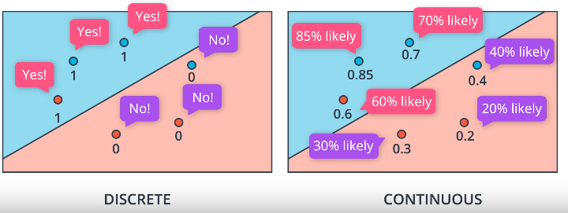
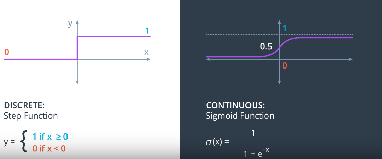
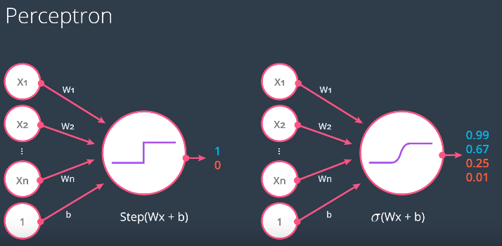
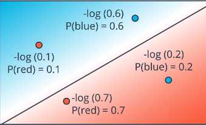
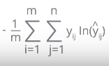

# Error Functions and Continous Predictions

## Error Functions
Measure of 'distance' from the solution/goal.

Should be:
* Differentiable
* Continuous

Need continous predictions

## Continous Predictions

* The probability of a point being blue is a **function of the points distance from the line**

### Sigmoid Activation Function


Step Function prediction used in [linear region perceptron](./perceptron-algo-linear.md) is **discrete** (1 or 0)

Sigmoid Function used to give **continous** probabilities:
* S(x) = 1/(1+e<sub>-x</sub>)

Used in a perceptron, Wx+b is calculated and the result is passed to the sigmoid function:



* When **Wx+b=0**, sigmoid function returns 0.5, meaning the point has a 50% chance of being in one classification or the other.

### Softmax Function/Normalized Exponential Function
Extension of Sigmoid Activatino function for **>=3 classes** in the problem.

Formal Definition:

* 'Squashes' a *K*-dimensional vector **z** of real values in to a *k*-dimensional vector of &sigma;(**z**) of real values in the range [0,1] that sum to 1 [source](https://en.wikipedia.org/wiki/Softmax_function)
    * &sigma;: **R**<sup>K</sup> -> [0,1]<sup>K</sup>
    * &sigma;(**z**)<sub>j</sub> = e<sup>z<sub>j</sub></sup> / &Sigma;<sup>K</sup><sub>k=1</sub> e<sup>z<sub>k</sub></sup>

Exponential function is used as it **always returns a positive** number
    * Avoid division by 0 with negative numbers as inputs:
        * ie 1/ 1+0+(-1) = 1/0

Used to represent a **categorical distribution**
    * Probability distribution over *K* different possible outcomes

Probability Classification definition:
* Given Linear Function Scores: Z<sub>1</sub>,...,Z<sub>n</sub>
* P(class i) = e<sup>Z<sub>i</sub></sup>/e<sup>Z<sub>1</sub></sup>+...+e<sup>Z<sub>n</sub></sup>

```Python
import numpy as np

def softmax(L):
    """
    Perform Softmax Algorithm on list of

    Args:
        L (list): List of numbers
    Returns:
        List L after applying softmax to each element
    """
    denominator = sum(np.exp(L))
    return [np.exp(x)/denominator for x in L]
```

## Cross Entropy Error Function
 For y<sub>i</sub>=label<sub>i</sub> (true value), p<sub>i</sub> = probability given by model:
* Cross-Entropy = -&sum;<sup>m</sup><sub>i=1</sub> y<sub>i</sub>log(p<sub>i</sub>) + (1-y<sub>i</sub>)log(1-p<sub>i</sub>)

### Example

* if y = 1:
    * P(blue) = y&#770;
    * Error = -ln(y&#770;)

* if y = 0:
    * P(red) = 1-P(blue)=1-y&#770;
    * Error = -ln(1-y&#770;)

* Therefore Error = -(1-y)(ln(1-y&#770;))-yln(y&#770;)
    * If y=1, first term = 0
    * If y=2, second term = 0
    * Gives correct error for both cases
* Error Function = -1/m &sum;<sup>m</sup><sub>i=1</sub> (1-y<sub>i</sub>)(ln(1-y&#770;<sub>i</sub>)) + y<sub>i</sub>ln(&#770;<sub>i</sub>)
    * Takes **average** not sum (1/m term)

Since y&#770; = &sigma;(Wx+b)
* E(W,b) = -1/m &sum;<sup>m</sup><sub>i=1</sub> (1-y<sub>i</sub>)(ln(1-&sigma;(Wx<sup>i</sup>+b)) + y<sub>i</sub>ln(&sigma;(Wx<sup>i</sub>+b))

Goal = **minimize E(W,b)**

For **multi-class**:


