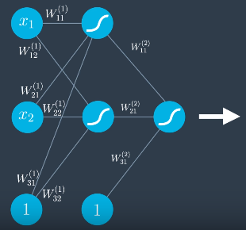
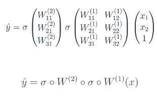
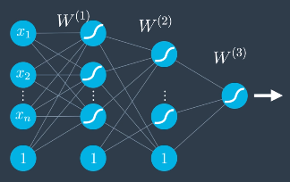
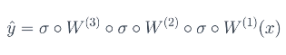

# Feedforward
Process used to turn input into an output in a neural network.

Each layer in the network contains a **matrix of weights**: W(i):

* Representation has bias in separate nodes with value 1 and weigh=bias - convenience

Take input vector and apply a sequence of linear models and sigmoid functions:
* Multiply vector of inputs (including bias) by the sigmoid of that layers weights -> repeat using next layer weights:

More layers: 

