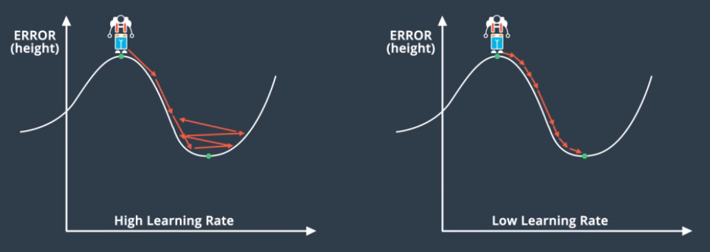
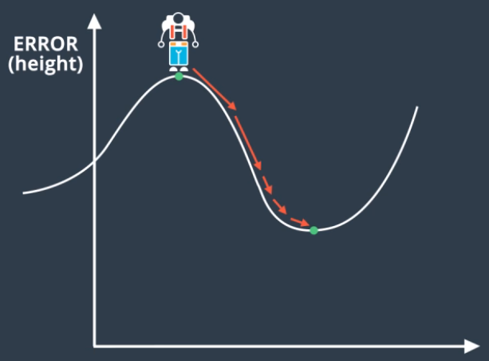

# Choosing Learning Rates
In general:
* High learning rate = faster model, but may miss local minima
* Low learning rate = slower, but takes smaller steps so less likely to miss local minima

## Decreasing Learning Rate
Learning rate **decreases** as the model gets closer to optimal
* Error curve is steep at the beginning (model is not optimal)
    * Larger learning rate to 'descend' faster
        * Larger steps
* Errpr curve 'levels out' as the model improves
    * Lower learning rate to find local minimum accurately
        * Smaller steps
    