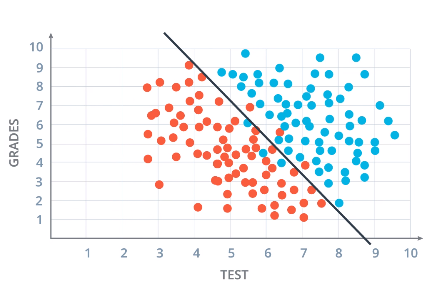

# Linear Boundaries
Split a vector space into **two sets** - one for each class - **binary classifier**. All points on one side of the boundary are classified as belonging to one class and all those on the other side belong to the other class.

## Example: Acceptance at University
* Blue = accepted
* Red = Rejected 

* Boundary Line = 2x1 + x2 -18 = 0
* Score = 2*Test + grades -18
    * i.e. student gets 7 in test and 6 in grades, score = 2
* Prediction:
    * Score > 0 -> Accept
    * Score < 0 -> Reject

## General Case
* In 2D:
    * Boundary line = w1x1 + w2x2 + b = 0
        * wi = weights
        * xi = input
        * b = bias
    * Vector notation = Wx + b = 0
        * W = (w1, w2)
        * x = (x1, x2)
* In n-D:
    * Boundary = *n*-1 dimensional **hyperplane** =  w1x1 + w2x2... wnxn + b = 0
    * Vector notation = Wx + b = 0
        * W = (w1, w2,..., wn)
        * x = (x1, x2,..., xn)
* y = **label**: **0 or 1**
    * What is being predicted
    * Blue points y=1, red points y=0
* Prediction: y&#770;:
    * 1 if Wx + b >= 0
    * 0 if Wx + b < 0
* **Goal** is to find y&#770; that resembles *y* as closely as possible:
    * Find boundary line such that most of the blue points are above and most of the red points are below
