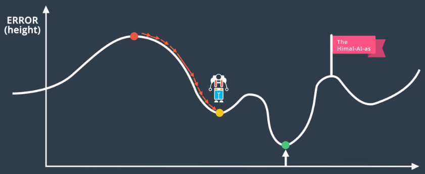

# Local Minimum Problem
Training algorithms (gradient descent) unable to 'see' the global minimum and get 'stuck' in a local minimum.

Gradient descent will reach the local minimum and assume it is finished:

## Solution: Random Restart
Run gradient descent multiple times, each starting from a random point.
* Increases the *probability* of reaching the global minimum
* Or at least finding a local minimum which is a reasonable approximation of the global minimum.

## Solution: Momentum
Give the step size a momentum, in order to 'overcome' local minima.

Helps accelerate SGD in the relevant direction and dampens oscillations. 

Each step is the average of the previous steps, weighted by &beta; momentum constant in range (0,1) - often around **0.9**:
* step(n) &rarr; step(n) + &beta;step(n-1) + &beta;2step(n-2)+...
* &beta; term uses increasing powers to weight recent steps more heavily that past steps

1. vt=&beta;i+1vt-1 + &alpha;&nabla;WE(W)
2. W = W-vt
    * vi = update vector at time *i*
    * &alpha; = learning rate
    * E(W) = Error function
    * W = Weights matrix(parameters)

## Nesterov Accelerated Gradient (NAG)
Extension of momentum that slows down as gradient begins to increase to smooth the ascent.
* momentum = ball rolling down a hill, following the slope blindly
* NAG = smarter ball, has notion of where it is going to it slows down before the hill slopes up again

NAG makes a jump in the direction of the previous accumulated gradient, then measures this new gradient and makes a **correction**.

1. vt=&beta;i+1vt-1 + &alpha;&nabla;WE(W-&beta;i+1vt-1)
2. W = W-vt

*  Blue = Momentum
* Brown = first NAG jump
* Red = NAG correction
* Green = NAG complete update

Anticipatory update prevents moving too fast &rarr; increased responsiveness.

Updates adapt to the slope of the error function &rarr; speed up Gradient Descent.

See [Optimizers](./optimizers.md) notes for futher detail and solutions to gradient descent problems.