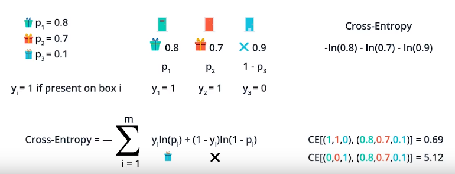

# Maximum Likelihood Estimation
Estimating the correct parameters of a statistical model, given observations, by finding the parameter values that maximise the **likelihood** of making the observations given the parameters [source](https://en.wikipedia.org/wiki/Maximum_likelihood_estimation).

## Likelihood Function
* Function of the parameters of a statistical model, given observations
    * i.e. How likely is it that this model produces data matching the observations
* Joint probability of the variables given the parameters:
    * L(θ|x)=∏<sup>n</sup><sub>i=1</sub>f(X<sub>i</sub>|θ)

  

Likelihood function uses the probabilities that the variables are *actually* what they are i.e. a red point is actually a red point.

Here, P(red) = 1-p(blue):


Model on right maximises the likelihood and is therefore preferable:


## Cross Entropy
The sum of the negative of the logarithm of the probabilities

For discrete distributions p and q:
* Cross-Entropy = - &sum;<sub>x</sub>p(x)log(q(x))

As error function: For y<sub>i</sub>=label<sub>i</sub>(true value), p<sub>
i</sub> = probability given by model:
* Cross-Entropy = -&sum;<sup>m</sup><sub>i=1</sub> y<sub>i</sub>log(p<sub>i</sub>) + (1-y<sub>i</sub>)log(1-p</sub>i</sub>)



```Python
import numpy as np

# Write a function that takes as input two lists Y, P,
# and returns the float corresponding to their cross-entropy.
def cross_entropy(Y, P):
    Y = np.float_(Y)
    P = np.float_(P)
    return -np.sum(Y*np.log(P)+(1-Y)*np.log(1-P))
```
Without numpy (would be slow for real uses):
```Python
import math
def cross_entropy(Y,P):
    res = 0
    for y, p in zip(Y,P):
        res += y*math.log(p)+(1-y)*math.log(1-p)
    return -res
```

### Explanation
Using values in range [0,1] in the likelihood function will quickly produce very small numbers:
* Product of many small numbers

Calculating product is also expensive

Use **log** likelihoods
* log(ab) = log(a) + log(b)

log(x) where x is between [0,1] always produces a **negative** number

Take the negative of the log to make positive.
* i.e. ln(0.6) = -0.51, -ln(0.6) = 0.51

Sum to give the **Cross entropy**


* -log(probability) for each point represents **error**
    * Correct classification = low value
    * Incorrect classification = high value

**Goal=minimize cross entropy**

### Multi Class Cross Entropy


n = number of doors (observations)
m = number of animals (classes)


This works as only the probabilities which have actually occured are taken into account:
* y<sub>ij</sub> = {0,1} i.e. indicates whether the event has actually occured. If it hasnt y<sub>ij</sub> is 0 and the probability isn't taken into account.
