# Neural Network Architecture
Multi-layer combinations of linear perceptron models.

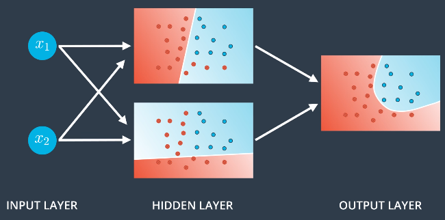

## Non-Linear Models
Combine linear regions to produce non-linear regions:

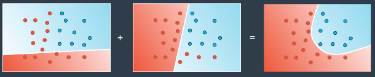

Linear model = linear probability space:
* Gives classificiation probability of each point in the space (probability of each point being blue in example)

Combine the probabilities of each point:
* Add the probabilities -> apply sigmoid function
    * Sum of probabilities > 1, sigmoid outputs between 0-1

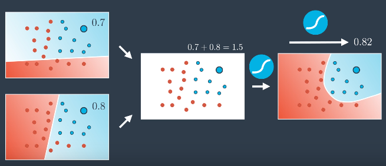

With weights and bias:

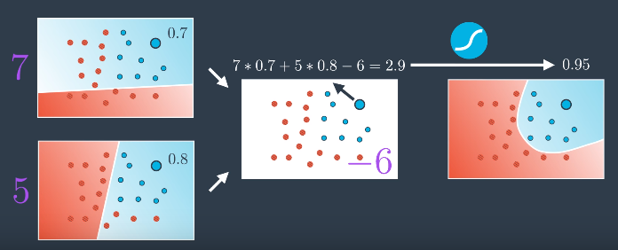

### Using Perceptrons
Combine perceptrons of linear models by passing outputs into another perceptron with model weights/bias:

Combine using linear equation 7&middot;Model1 + 5&middot;Model2 -6:

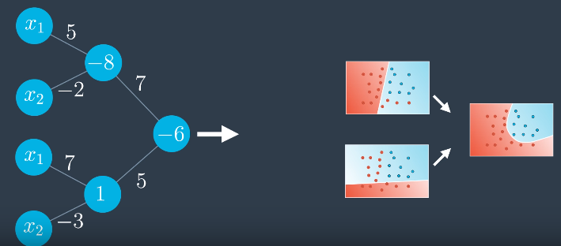

Removing duplicate nodes:

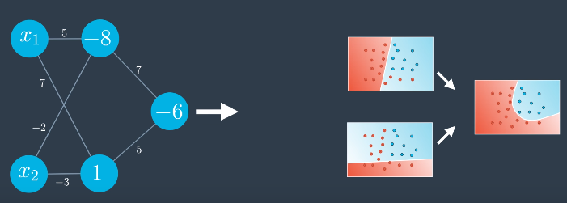

## Multiple Layers
Create complex neural networks by changing the architecture:
* Add more nodes to input, hidden and output layer
    * n-nodes in input layer = output data in n-dimensional space

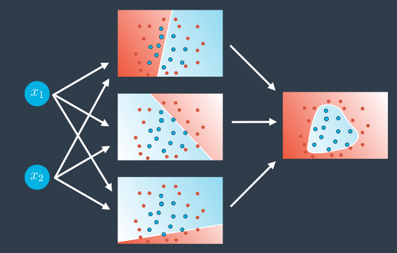

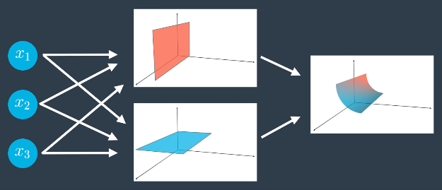

* Add more layers -> **deep neural network**
    * Linear models combine to create non-linear models, which then combine to create even more non-linear models
    * Repeat to create highly complex models with many hidden layers

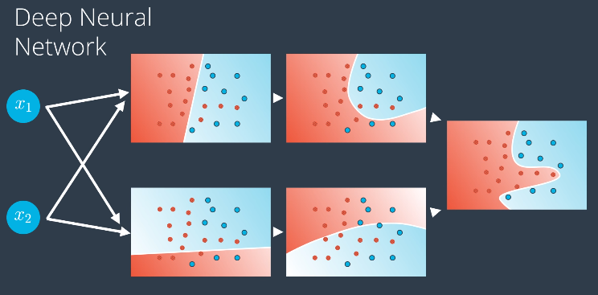

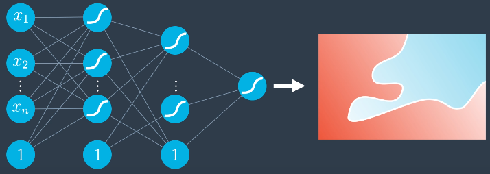

## Multi-Class Classification
Each node in the output layer represents a class and gives the probability of the input being that class. Use **Softmax** on the outputs to obtain well-defined probabilities for each class.
* Number of nodes in output layer = number of classes

Classifying an image into Duck, Beaver or Walrus:

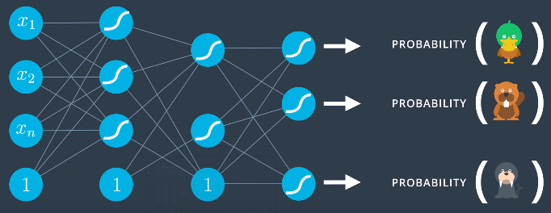