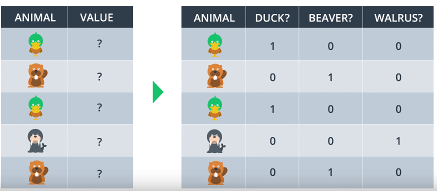

# One-Hot Encoding
Transform categorical features into a format for easier computation.

Uses boolean flags for the categories, example:
* Flower feature could have 3 categories: 'daffodil', 'lily', 'rose'
* One-Hot encoding converts it into three boolean features: 'is_daffodil', 'is_lily', 'is_rose'/