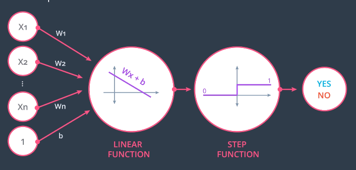
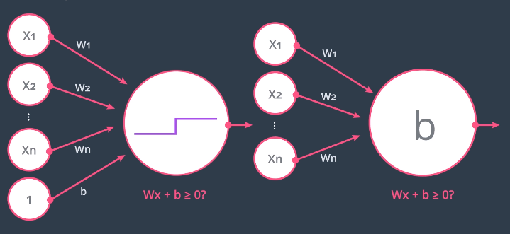
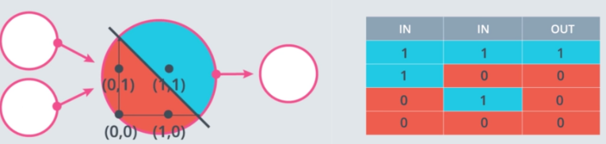
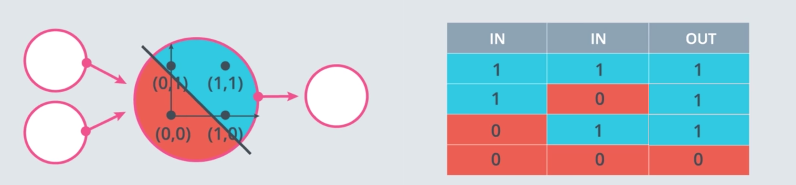
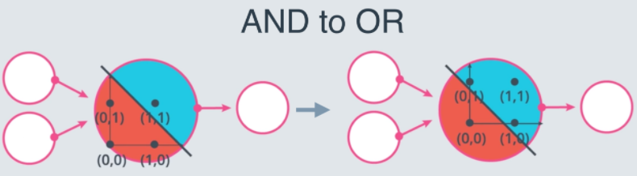
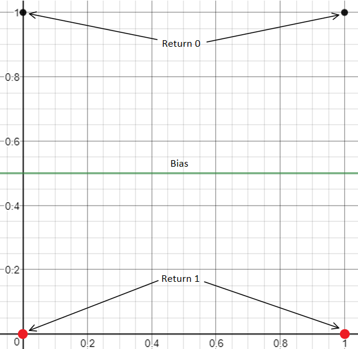
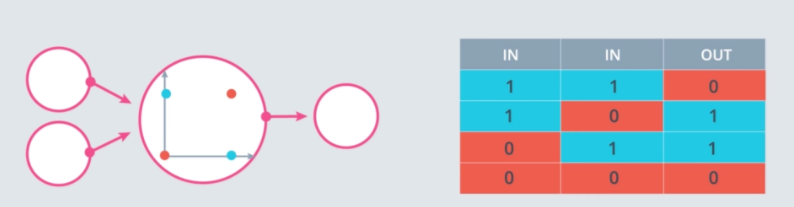
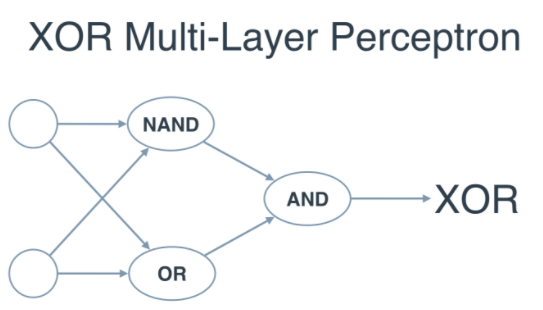

# Perceptrons
* Encoding of equation Wx+b ([boundaries](./linear-boundaries.md)) as a graph
    * Inputs: nodes w/values x1-xn and corresponding edge weights w1-wn
    * **Linear function** node calculates Wx+b:
        * Wx+b = &sum;ni=1Wixi + b
    * **Step function** node calculates result:
        * Return 1 if input is >= 0
        * Return 0 if input < 0

    
* Bias unit can be an input node w/value of 1 and weight *b* or the bias can be inside the node:
    * 
* Algorithm for learning a binary classifier

## Perceptrons as Logical Operators
Combine perceptrons using different weights and biases to produce logical operators

### AND

* w1 = 1
* w2 = 1
* b = -2

### OR

* Increase both weights OR decrease magnitude of bias

### NOT
* Only cares about 1 input
    * Inverts it: 1->0, 0->1

* w1 = 0
    * Ignore first input
* w2 = -1
    * Invert second input
* b = 0.5

### NAND
* AND followed by NOT

### XOR

