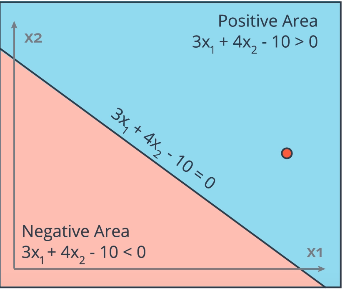
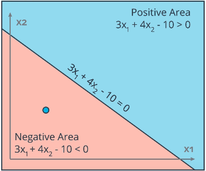
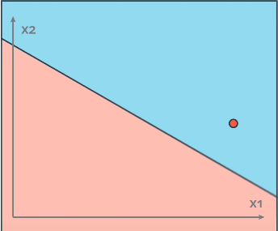
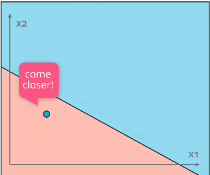

# Perceptrons
* Encoding of equation Wx+b ([boundaries](./linear-boundaries.md)) as a graph
    * Inputs: nodes w/values x<sub>1<sub>-x<sub>n</sub> and corresponding edge weights w<sub>1</sub>-w<sub>n</sub>
    * **Linear function** node calculates Wx+b:
        * Wx+b = &sum;<sup>n</sup><sub>i=1</sub>W<sub>i</sub>x<sub>i</sub> + b
    * **Step function** node calculates result:
        * Return 1 if input is >= 0
        * Return 0 if input < 0

    
* Bias unit can be an input node w/value of 1 and weight *b* or the bias can be inside the node:
    * 
* Algorithm for learning a binary classifier

## Perceptrons as Logical Operators
Combine perceptrons using different weights and biases to produce logical operators

### AND

* w<sub>1</sub> = 1
* w<sub>2</sub> = 1
* b = -2

### OR


* Increase both weights OR decrease magnitude of bias

### NOT
* Only cares about 1 input
    * Inverts it: 1->0, 0->1


* w<sub>1</sub> = 0
    * Ignore first input
* w<sub>2</sub> = -1
    * Invert second input
* b = 0.5

### NAND
* AND followed by NOT

### XOR


## Perceptron Learning Algorithm (Linear Regions)
Given a training set where the desired output is known for each input, find the most optimal weights and biases (i.e. boundary line).
* **Will not work** with non-linear regions
### Algorithm
For a point with coordinates (p,q), label y and prediction given by y&#770; = {1 if w<sub>1</sub>x<sub>1</sub>+w<sub>2</sub>, x<sub>2</sub>+b >=0, else 0}, with **learn rate** &alpha;:
* If point is correctly classifed - do nothing
* If classified positive, but label is negative (point above line):
    * Subtract &alpha;p, &alpha;q and &alpha; from w<sub>1</sub>, w<sub>2</sub> and *b* respectively
* If classified negative, but label is positive (point below line):
    * Add &alpha;p, &alpha;q and &alpha; from w<sub>1</sub>, w<sub>2</sub> and *b* respectively

Apply repeatedly until no change in number of incorrect classifications.
```Python
def perceptronStep(X, y, W, b, learn_rate = 0.01):
    """
    Args:
        X (list of lists): List of inputs [[x1, x2], [x1,x2]...]
        y (list): List of expected outputs for each input (same order) i.e. expected output for X[0] = y[0]
        W (list): List of weights [w1,w2]
        b (int or float): bias
        learn_rate (int): Learning rate constant factor applied to adjustments
    Returns:
        Tuple of modifed weights and bias (W,b)
    """
    for i in range(len(X)):
        p = prediction(X[i],W, b) # calculates Wx+b >=0
        if p != y[i]:
            if p == 0:
                W0] += X[i][0]*learn_rate
                W[1] += X[i][1]*learn_rate
                b += learn_rate
            elif p == 1:
                W[0] -= X[i][0]*learn_rate
                W[1] -= X[i][1]*learn_rate
                b -= learn_rate
    return W, b
```
### Explanation
Algorithm repeatedly adjusts the boundary line used in the perceptron by 'moving' it closer to each misclassified point.
#### Move a line towards a point
* Point above the line:
    * Subtract point coordinates from paramaters of the line
    * 
        * Line: 3x<sub>1</sub> + 4x<sub>2</sub> - 10=0
        * Point: (4,5)
        ```
        - 3  4  -10
          4  5   1 <--(1 from bias)
        ------------  
         -1  -1  -11
        ```
        * New line: -x<sub>1</sub> -x<sub>2</sub> - 11 =0
        * Point(4,5) will now be much closer, *if not below* the line
* Point below the line:
    * Add point coordinates to the parameters of the line
    * 
        * Line: 3x<sub>1</sub> + 4x<sub>2</sub> - 10=0
        * Point: (1,1)
        ```
        + 3  4  -10
          1  1   1 <--(1 from bias)
        ------------  
          4  5  -9
        ```
        * New line: 4x<sub>1</sub> +5x<sub>2</sub> - 9=0
        * Point(1,1) will now be much closer, *if not above* the line

#### Moving Line with Learning Rate
Line movements can be **large**, causing other points to become vastly misclassified. Use a **learning rate** to avoid this.

Same procedure as moving a line towards a point, except the coordinates of the point are **multiplied by a < 0 constant factor (learning rate)**

* Point above the line:
    * Subtract point coordinates, multiplied by **learning rate** from paramaters of the line
    * 
        * Line: 3x<sub>1</sub> + 4x<sub>2</sub> - 10=0
        * Point: (4,5)
        * Learning rate: 0.1
        ```
        point*learning rate = (4*0.1,5*0.1) 1*0.1 = (0.4,0.5) 0.1
        
        - 3    4     -10
          0.4  0.5   0.1 <--(1 from bias)
        -----------------  
          2.6  3.5  -10.1
        ```
        * New line: 2.6x<sub>1</sub>+3.5x<sub>2</sub> - 10.1 =0
        * Point(4,5) will now closer to the line (but not drastically):
        * 

* Point below the line:
    * Add point coordinates multiplied by **learning rate** to the parameters of the line
    * 
        * Line: 3x<sub>1</sub> + 4x<sub>2</sub> - 10=0
        * Point: (1,1)
        * Learning rate: 0.1
        ```
        point*learning rate = (1*0.1,1*0.1) 1*0.1 = (0.1,0.1) 0.1

        + 3    4    -10
          0.1  0.1   0.1 <--(1 from bias)
        -----------------  
          3.1  5.1  -9.9
        ```
        * New line: 3.1x<sub>1</sub>+5.1x<sub>2</sub>-9.9=0
        * Point(1,1) will now be closer to the line(but not drastically):
        * 

* Applied **repeatedly** for all misclassified points in the training set forms the percpetron algorithm
