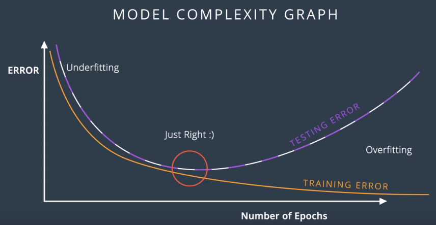
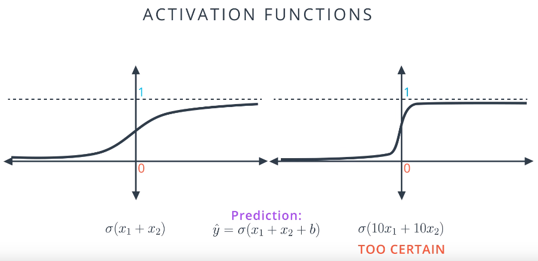

# Regularization
Process of introducing additional information in order to prevent **underfitting and/or overfitting**.

## Motivation: Underfitting and Overfitting
* Underfitting = model cannot adequately capture the underlying structure of the data
    * Model has missing parameters that would be present in a correctly specified model.
    * i.e. fitting a linear model to non-linear data
* Overfitting = model corresponds too closeloy to the training data adn therefore fails to fit additional data
    * Model contains **more parameters** than can be justified by the data
    * Occurs because criterion for selecting a model are different than those for judging suitability of the model.
        * Selected based on performance with training data
        * Suitability determined on unseen data
        * Model 'memorizes' training data

## Early Stopping
Used to avoid overfitting for a learner using an **iterative** method.
* i.e. gradient descent

1. Split training data into **training set** and **validation set**
    * Often 2:1 proportion (still keep plenty of data for training)
2. Train model using the training set and evaluate the training error using the testing/validation error given by the validation set after a set number of epochs
3. Stop training when the testing/validation error is higher than its previous value
4. Use weights for the model in the previous step as the result of the training run
    * i.e. 1 step before testing/validation error started increasing

## L1 and L2 Regularization
Complex models lead to overfitting

Large coefficients -> overfitting

Model on the left is better:

* Model on the right has little room for gradient descent
    * Function is steeper
    * Derivative are mostly close to 0 and then **very large** towards the middle of the curve
* Model on the right will produce **very large** errors for misclassified points
    * Difficult to train the model to correct the errors

Solution: **Penalize large weights**
* Add a **penalty term** to the error function which is large when weights are large
    * Increase the error for models with large weights

The &lambda; term in L1 and L1 regularizationdetermines size of penalty for large weights

**L1** Regularization:
* Add sum of absolute values of the weights, multiplied &lambda;
* Penalty term = &lambda;(|w1|+...+|wn|)
    * i.e Error function E = -1/m &sum;mi=1 (1-yi)(ln(1-y&#770;i)) + yiln(&#770;i) + &lambda;(|w1|+...+|wn|)
* Produces **sparse vectors**
    * Sparsity: (1,0,0,1,0)
    * Good for feature selection

**L2** Regularization:
* Add sum of *squares* of the weights, multiplied &lambda;
* Penalty term = &lambda;(w12+...+wn2)
    * i.e Error function E = -1/m &sum;mi=1 (1-yi)(ln(1-y&#770;i)) + yiln(&#770;i) + &lambda;(w12+...+wn2)
* Tries to maintain the weights homogenously small -> **doesn't favour sparse vectors** &rarr; 
    * Sparsity: (0.5,0.3,-0.2,0.4,0.1)
    * Normally better for training models

## Dropout
Prevent overfitting due to the training being dominated by a certain part of the network which has large weights.
* A fully connected layer occupies most of the parameters
* Neurons develop **co-dependency** during training
* All dependent on the dominant section -> reduced power of each neuron -> over fitting
 
Done by **randomly 'ignoring' nodes** during training. These nodes are not considered during either forward or backward passes.

At each training stage, individual nodes are dropped out of the network with a probability *p* i.e. *p*=0.2
* Gives a reduced network

After a sufficient number of epochs, each node on average will have been trained an equal amount.