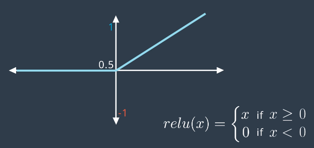

# Vanishing Gradient
Occurs when the gradient of the error function becomes very small during training. The weights in the network will therefore be updated by very small amounts or in worst case not at all - stopping training.

## Sigmoid Function Example

Gradient at either side becomes almost 0.

When used in **backpropagation**, the gradient of the error function is the **product** of its partial derivatives - which are all **derivatives of sigmoid** function
* Derivatives of sigmoid can be small
* Product of small values = *very small*

## Solution: Change Activation Function
Functions that have larger derivatives -> partial derivates of Error function are larger -> derivative of Error function is larger.

### Hyperbolic Tangent Function

Range is between **-1,1** &rarr; derivatives are larger than Sigmoid.

### Rectified Linear Unit (ReLU)

For input *x*: returns **maxi(*x*,0)**
* If *x* is positive -> returns *x*
* Else returns 0

Derivative is 1 when *x* is positive.

Use ReLU in multilayer perceptron:

* Note: final layer uses Sigmoid as output value still needs to be a probability in range (0,1)