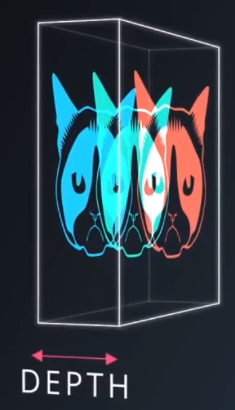

# Convolutional Layers
A type of hidden layer using local connectivity - that can be used in CNN's.
* Nodes in each layer are connected to a small subset of the previous layers nodes

1. Select a width and height for an **image kernel/convolution window** (called either)
    * 
2. 'Slide' convolution window horizontally and vertically over matrix of image pixels
    * 
3. Each position of the windows defines a collection of pixels for a region
4. Each collection of pixels is connected to a single hidden node
    * 
5. All the hidden nodes for the image produce a convolutional layer

[Image Kernel Visualization](http://setosa.io/ev/image-kernels/)

View [aind2-cnn/conv-visualization/conv_visualization.ipynb](./aind2-cnn/conv-visualization/conv_visualization.ipynb)

## Filters
Represents weights for a **pattern of pixels**, used to calculate the values of the nodes in a hidden layer.

Each filter uses different weights in order to **detect different patterns**.

Diagonal white line filter:

The maximum value for this filter is 3, and will only occur with a diagonal white line surrounding by black. 

The filter will detect that this region in the input layer is identical to the previous one - the patterns match:

Convolutional layers will have many collections of nodes, each representing a different filter:

Blue and green nodes represent 2 different filters:

Filters 1 and 2 detect vertical edges. Filters 3 and 4 detect horizontal edges:
* Edges in an image are lines of darker pixels next to line of lighter pixels

Similar to weights in an MLP, filters are initialised randomly and adjusted during training.

## Colour Images
Interpreted as 3d array of 2d matrices, for RGB each corresponding to one of Red Green and Blue channels:
* 

Use 3d array for filters:
* One 2d array filter for each colour channel

For **one filter** on a colour image:

Multiple filters on colour image:
* Multiple 3d arrays, each defining a filter

## Multiple Layers
Take feature maps from a convolutional layer and stack to create a 3d array:
* 
* 

Use the 3d array as input to another convolutional layer:
* Discover patterns within patterns (within patterns...)
* 