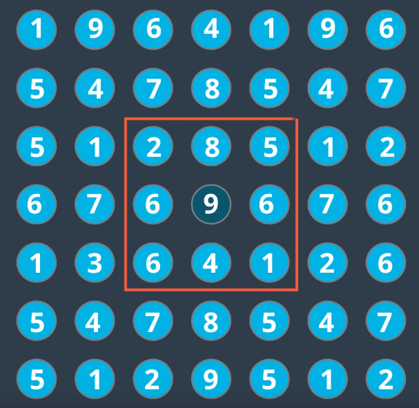
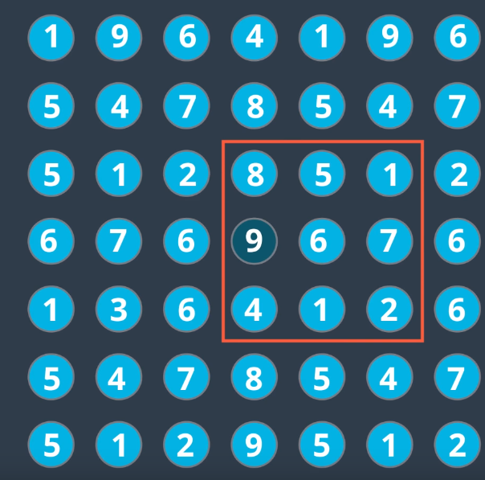

# Image Augmentation for CNN Classification

Algorithm needs to learn an **invariant representation** of the image.

Goal of image classification is to determine whether an object is present in an image or not, **irrespective of**:
* Size
    * Scale Invariance
* Rotation/Angle
    * Rotation Invariance
* Position
    * Translation Invariance

Max-pooling layers provide some translation invariance:
* Takes max-value of each image kernel
* If image translated slightly, the max is likely to stay the same
    * 
    * 

## Solution
Make algorithm more statistically invariant include augmented version of training images
* i.e include rotated versions of images, translated version and scaled versions.