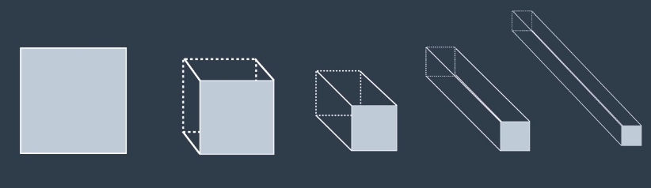
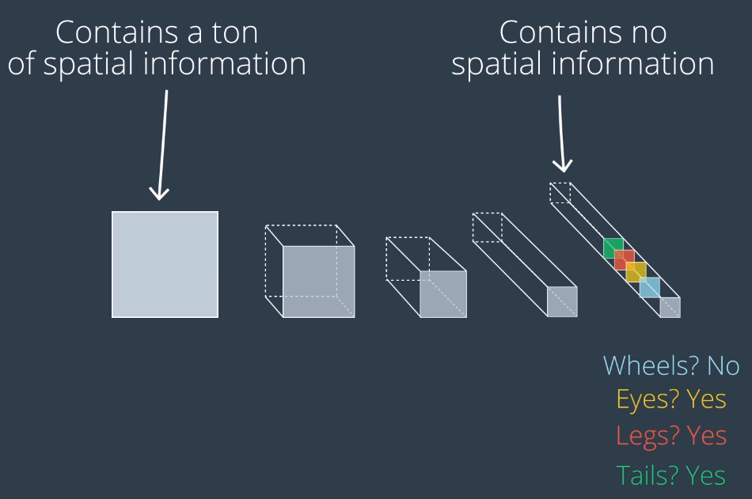
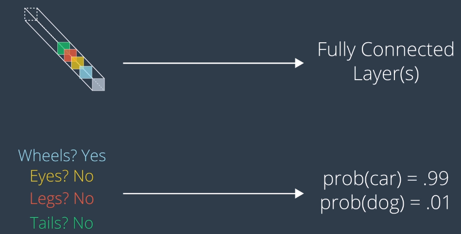

# CNN's for Image Classification

Require **fixed size input**
* Images must all be the **same size** for input into CNN
* Common to re-size all images to a square 
    * Usually power of 2 i.e 32x32

## Architecture Goal: Increase Depth, Decrease Width and Height
Left = input layer



* Input layer contains lots of **spatial information**
* Goal is to remove spatial information, leaving only information **encoding the content** of the image remains



Final max pooling layer can be vectorized and fed into a **fully connected** output layer to determine probabilities of objects in the model: 



* Convolutional layers **increase depth**
* Pooling layers **decrease width/height**

## Keras Example

For 32x32 pixel RGB images with 10 object classes:
* Alternating Convolutional and MaxPooling layers
    * Transform input array of image pixels into array where all spatial information has been removed
    * Only information encoding the content of the image remains
* Array then flattened to a vector
* Two final Dense layers to further elucidate image content
    * Final layer has 1 entry for each object class in the dataset and softmax for probabilities
```Python
from keras.models import Sequential
from keras.layers import Conv2D, MaxPooling2D, Flatten, Dense

model = Sequential()
model.add(Conv2D(filters=16, kernel_size=2, padding='same', activation='relu', input_shape=(32, 32, 3)))
model.add(MaxPooling2D(pool_size=2))
model.add(Conv2D(filters=32, kernel_size=2, padding='same', activation='relu'))
model.add(MaxPooling2D(pool_size=2))
model.add(Conv2D(filters=64, kernel_size=2, padding='same', activation='relu'))
model.add(MaxPooling2D(pool_size=2))
model.add(Flatten())
model.add(Dense(500, activation='relu'))
model.add(Dense(10, activation='softmax'))
```
Output:
```
_________________________________________________________________
Layer (type)                 Output Shape              Param #
=================================================================
conv2d_1 (Conv2D)            (None, 32, 32, 16)        208
_________________________________________________________________
max_pooling2d_1 (MaxPooling2 (None, 16, 16, 16)        0
_________________________________________________________________
conv2d_2 (Conv2D)            (None, 16, 16, 32)        2080
_________________________________________________________________
max_pooling2d_2 (MaxPooling2 (None, 8, 8, 32)          0
_________________________________________________________________
conv2d_3 (Conv2D)            (None, 8, 8, 64)          8256
_________________________________________________________________
max_pooling2d_3 (MaxPooling2 (None, 4, 4, 64)          0
_________________________________________________________________
flatten_1 (Flatten)          (None, 1024)              0
_________________________________________________________________
dense_1 (Dense)              (None, 500)               512500
_________________________________________________________________
dense_2 (Dense)              (None, 10)                5010
=================================================================
Total params: 528,054.0
Trainable params: 528,054.0
Non-trainable params: 0.0
_________________________________________________________________
```