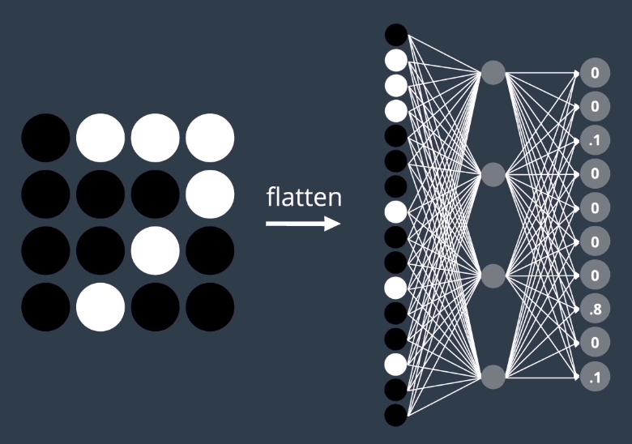
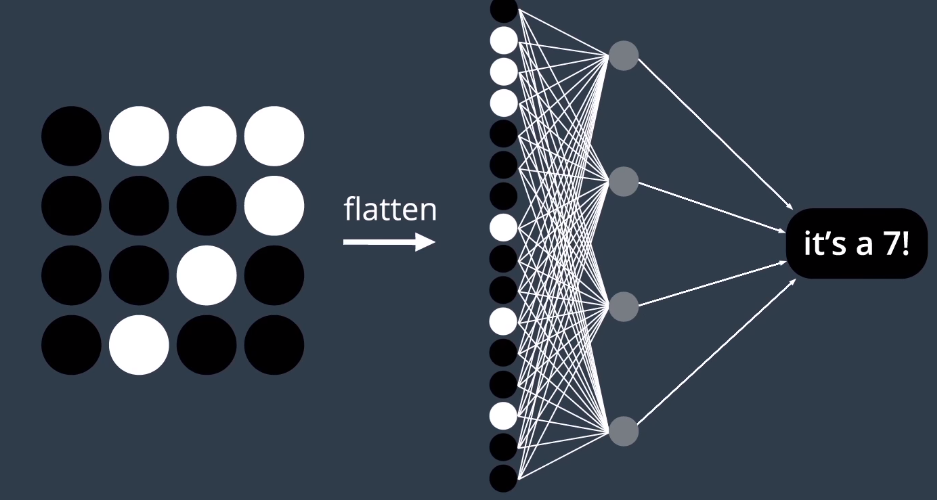
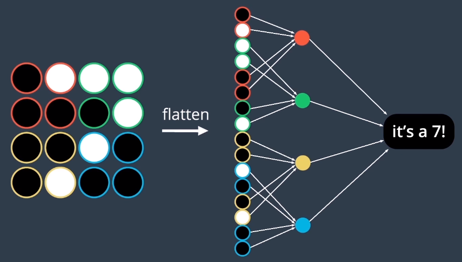
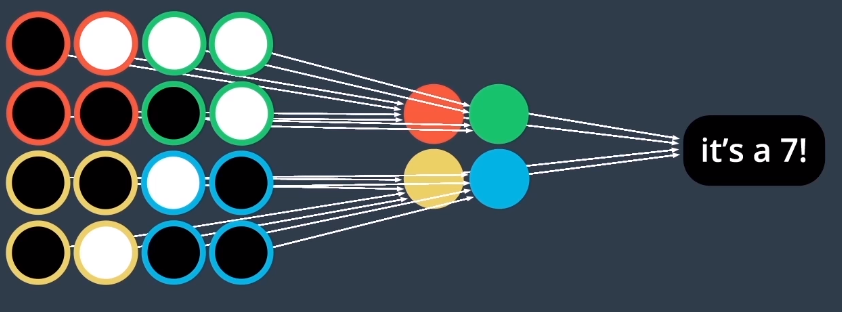
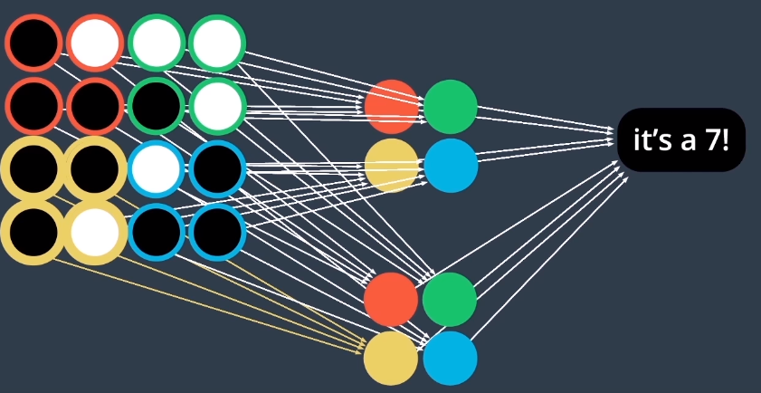

# Local Connectivity

MLP for recognising images ( for example [aind2-cnn/mnist-mlp](./aind2-cnn/mnist-mlp/mnist_mlp.ipynb)) has drawbacks -> CNN gives improvements.

* Multi-Layer Perceptrons (MLP)
    * Use only **fully** connected layers
        * Large number of parameters
        * Computational complexity gets out of control very quickly
    * Accept only **vectors** as inputs
        * Can lose information during vectorisation
        * Flattening matrix of an image loses information about where pixels are located in relation to each other
            * Can't 'see' patterns between pixels
* Convolutional Neural Networks (CNN)
    * Can use **sparsely** connected layers
        * Connections between layers are informed by 2d structure of image matrix
    * Can accept **matrices** as inputs

## Fully/Densely Connected Layers

Output layer predicts a 7:

Every hidden node is connected to every pixel in the input image - redundancy
* Every hidden node is responsible for gaining an understanding of the **entire** image all at once

## Locally Connected Layers
Input is broken up into separate regions. Hidden nodes are responsible for only one region.
* Uses 2d structure of image to selectively and conservatively add weights/parameters to the model

* Uses fewer parematers
* Less prone to overfitting
* 'Understands' how to interpret patterns contained within image data

Can rearrange the vectors as a matrix:

Can increase number of patterns able to detect by introducing more hidden nodes
* Each is still confined to analysing small regions in the input image

