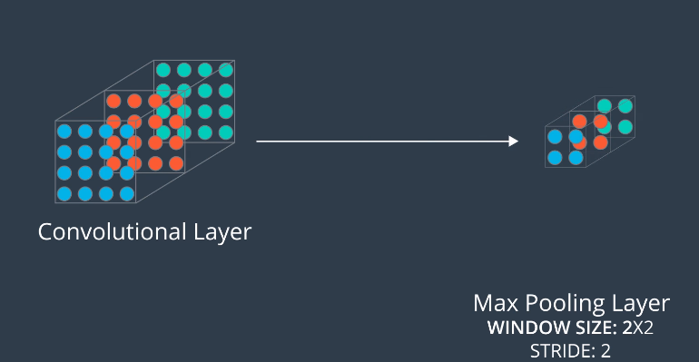

# Pooling Layers
Layers that **reduce dimensionality** of a convolutional network
* Complex dataset requires large number of filters
* -> higher dimensionality of convolution layers 
* -> more parameters 
* -> overfitting

Usually take convolutional layers as inputs, then output to another convolutional layer.

## Max Pooling Layer
Take 'stack' of feature maps as input. Reduces each feature map to the maximum values for each of the windows within it.




Output has the same number of feature maps, but with reduced dimensions.

Single depth slice example:


### Keras Example
To reduce a convolutional layer of size `(100,100,15)` to a size of `(50,50,15)`:
* ` MaxPooling2D(pool_size=2, strides=2)`

```Python
from keras.models import Sequential
from keras.layers import MaxPooling2D

model = Sequential()
model.add(MaxPooling2D(pool_size=2, strides=2, input_shape=(100, 100, 15)))
model.summary()
```
Output:
```
_________________________________________________________________
Layer (type)                 Output Shape              Param #
=================================================================
max_pooling2d_1 (MaxPooling2 (None, 50, 50, 15)        0
=================================================================
Total params: 0.0
Trainable params: 0.0
Non-trainable params: 0.0
_________________________________________________________________
>>>
```
## Global Average Pooling Layer
Take 'stack' of feature maps as input. Reduces each feature map to the average of all the nodes contained within it.
* More extreme type of pooling

Sum all nodes in feature = 80
16 nodes in feature
Average = 80/16 = 5:


Turns **3d array into a vector**


N.B: Other types of pooling layers do exist see [Keras documentation](https://keras.io/layers/pooling/) for more info