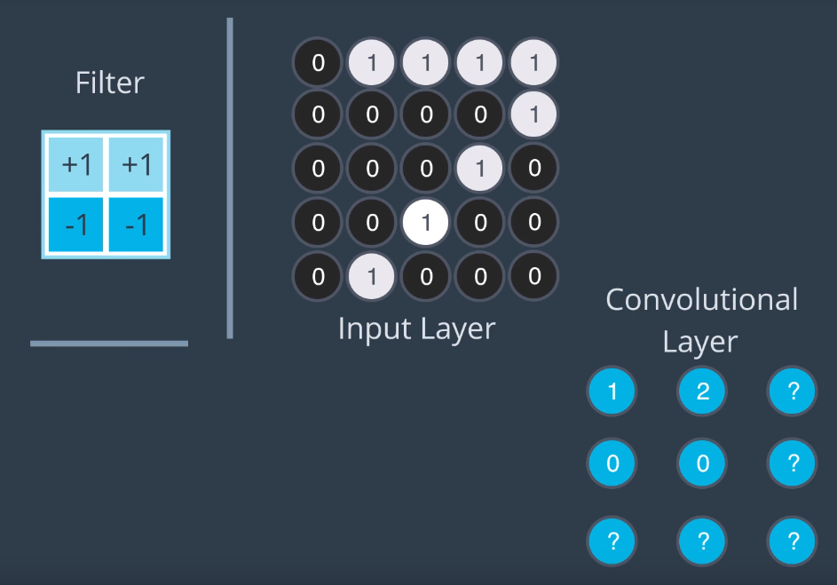

# Stride and Padding

## Stride
Hyperparameter defining the amount by which a filter 'slides' over an image.

A stride of 1 makes convolutional layer approximately the same dimensions as the input image (filter moves by 1 pixel each time).

## Padding
Filter can extend outside the boundaries of the image. Padding defines how to deal with this case.

'?' represents nodes where the filter extended outside the image

### 'Valid' Padding
Ignore any nodes which contain values outside the image boundary.

This can lead to the convolutional layer having no information about some regions of the image.
* Can **lose nodes**

Here, the convolution layer has no information about right and bottom regions of the image:

### 'Same' Padding
Pad the image with zeroes prior to using the filter for creating the nodes in the convolutional layer.
* Gives filter more 'room' 

Ensures the convolutional layer has contributions from **every region** in the image.