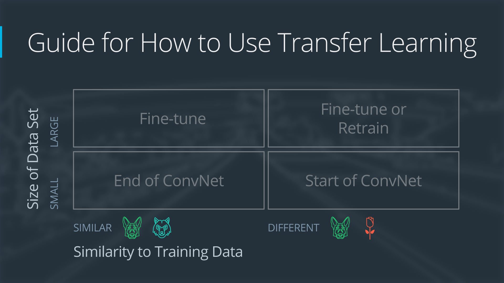
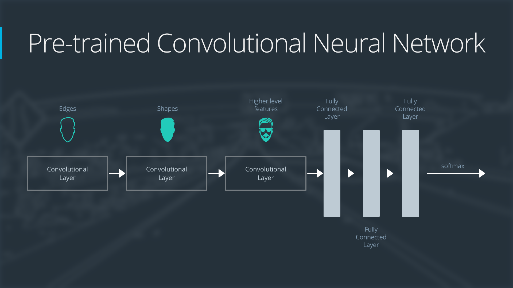
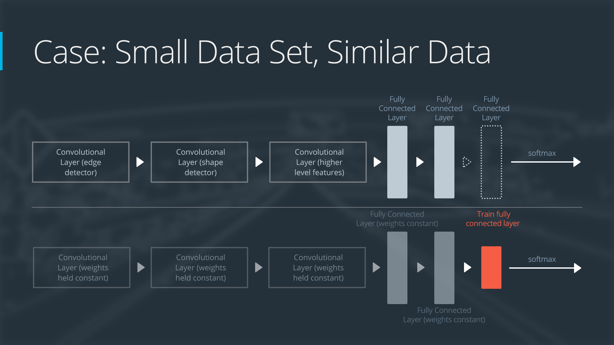
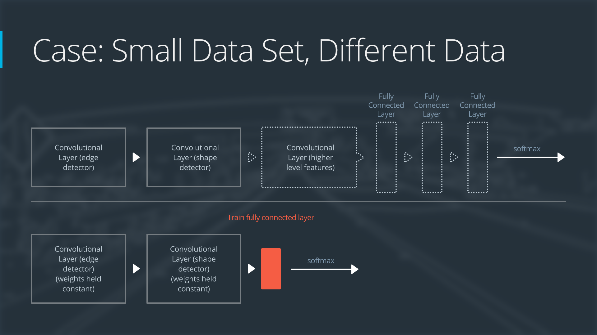
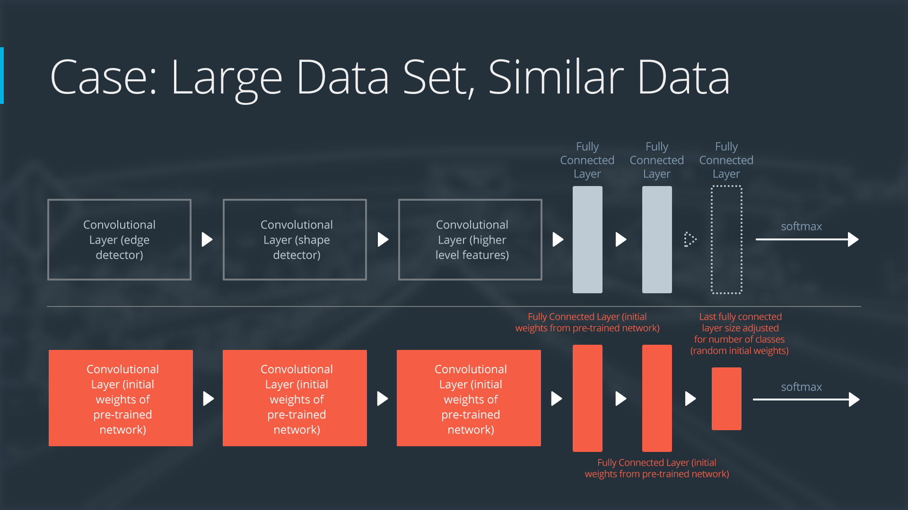

# Transfer Learning
**Adapt** a pre-trained neural network to a new, different data set.

May need to remove/adjust/re-train areas of the neural network.

Technique used depends on:
* Size of new data set
* Similarity of new data set to original data set

Main cases:
1. New data set is small and similar to original training data
2. New data set is small and different from original training data
3. New data set is large and similar to original training data
4. New data set is large and different from original training data

## Example Network

* Layer 1 -> detect edges
* Layer 2 -> detect shapes
* layer 3 -> detect higher level features

## 1: Small Data Set, Similar Data -> End of ConvNet
1. 'Slice' off end of neural network
2. Add a new **fully connected** layer with correct number of **classes** for new data set
3. Randomize weights of new layer -> **freeze** weight from pre-trained network
    * Avoids overfitting on the new small data set
4. Train network -> update weights of new layer

Data sets are similar -> most of pre-trained network layers already contain relevant information -> keep layer.

## 2: Small Data Set, Different Data -> Start of ConvNet
1. 'Slice' off most of the pre-trained layers at the beginning of the network
2. Add new fully connected layer with correct number of clases for new data set to the remaining pre-trained layers
3. Randomize weight of new layer -> **freeze** weights from pre-trained network
    * Avoids overfitting on the new small data set
4. Train network -> update weights of new fully connected layer

Data sets are different -> don't share higher level features.
* Only use layers containing lower level features

## 3: Large Data Set, Similar Data -> Fine-Tune
1. Remove last fully connected layer
2. Replace with new fully connected layer with correct number of classes for new data set
3. Randomize weights of new layer
4. Initialize rest of weights using pre-trained weights
5. Re-train entire network

Large data set -> overfitting not a concern -> don't need to freeze any weights -> can re-train entire network

Original and new training sets similar -> share higher level features -> use entire original network

## 4: Large Data Set, Different Data -> Fine-Tune or Retrain
1. Remove last fully connected layer
2. Replace with new fully connected layer with correct number of classes for new data set
3. Retrain entire network with randomly initalized weights

OR

Use same strategy as 3: Large and Similar Data

Initializing weights from pre-trained network may make training faster -> same case as large and similar data.

May not produce a successful model -> Randomly initialize weights and train from scratch

## Resources
* [Research Paper](https://arxiv.org/pdf/1411.1792.pdf)
* [Sebastian Thrun Cancer Detecting CNN](https://www.nature.com/articles/nature21056.epdf?referrer_access_token=_snzJ5POVSgpHutcNN4lEtRgN0jAjWel9jnR3ZoTv0NXpMHRAJy8Qn10ys2O4tuP9jVts1q2g1KBbk3Pd3AelZ36FalmvJLxw1ypYW0UxU7iShiMp86DmQ5Sh3wOBhXDm9idRXzicpVoBBhnUsXHzVUdYCPiVV0Slqf-Q25Ntb1SX_HAv3aFVSRgPbogozIHYQE3zSkyIghcAppAjrIkw1HtSwMvZ1PXrt6fVYXt-dvwXKEtdCN8qEHg0vbfl4_m&tracking_referrer=edition.cnn.com)
