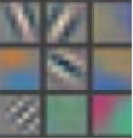
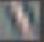
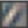
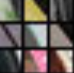
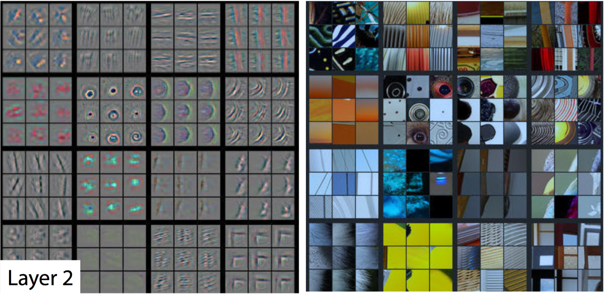
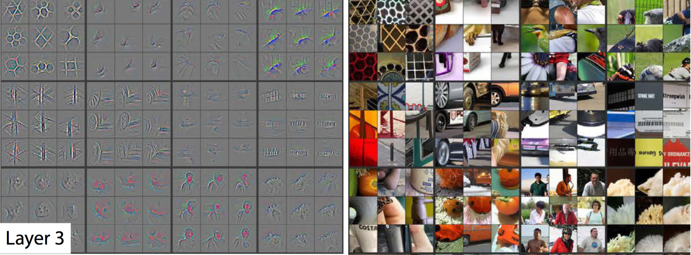
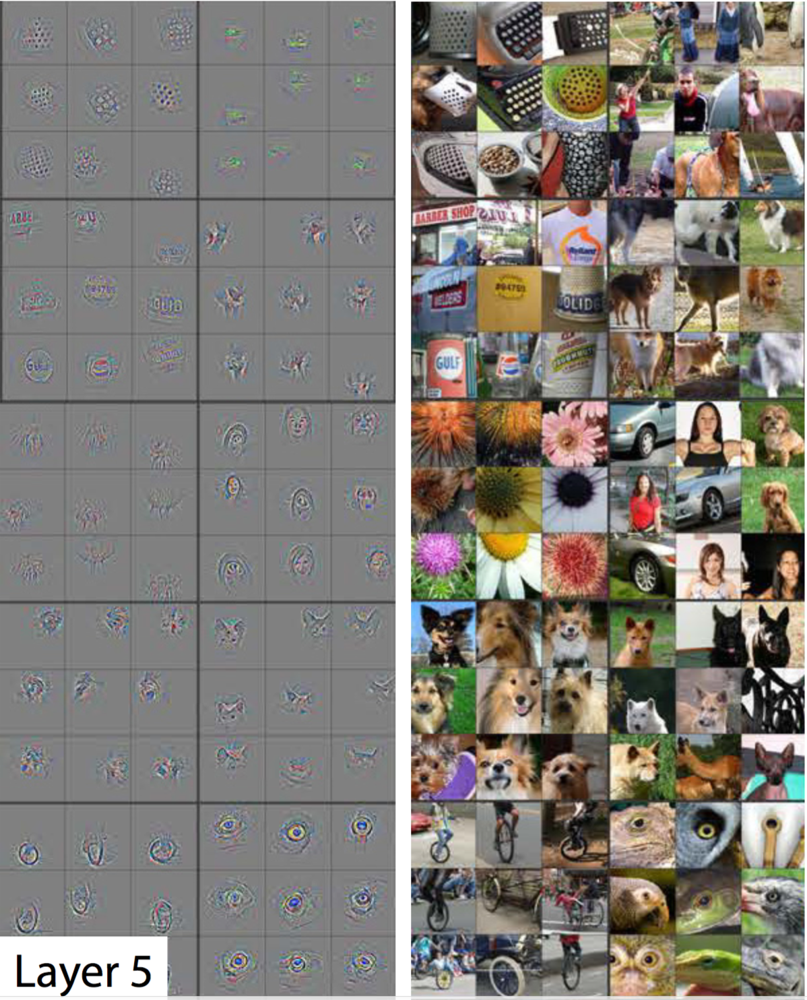

# Visualizing CNN's

* [Stanford CS231n](http://cs231n.github.io/understanding-cnn/)
* [Webcam Visualization](https://experiments.withgoogle.com/ai/what-neural-nets-see)
* [Picasso Visualizer](https://medium.com/merantix/picasso-a-free-open-source-visualizer-for-cnns-d8ed3a35cfc5)
* [Keras Blog Post](https://blog.keras.io/how-convolutional-neural-networks-see-the-world.html) - includes introduction to **Google Deep Dreams** 
    * **TRY CODING THIS**
* Research Paper [Understanding deep learning requires rethinking generalization](https://arxiv.org/abs/1611.03530)

## Example: Matthew Zeiler and Rob Fergus' Deep Visualization Toolbox
* CNN trained on ImageNet describe in [this paper](http://www.matthewzeiler.com/wp-content/uploads/2017/07/eccv2014.pdf)  by Zeiler and Fergus
* [Deep Visualization Toolbox Youtube](https://www.youtube.com/watch?v=ghEmQSxT6tw)

### Layer 1: Capture Simple Shapes/Patterns
Example activation patterns in layer 1 of the network:
* 

* Each image represents a pattern that is **recognized** by the first layer
    * i.e. causes the neurons to **activate** in the first layer
    * -45 degree lines
        * 
    * +45 degree lines
        * 

* Images that activated the -45 degree line pattern:
    * 
    * All have a -45 degree edge
    * Different colours/gradients/patterns **don't stop** the -45 degree pattern from activating

### Layer 2: Capture Complex Ideas
Activation patterns (left) for input images (right):
* 

* Recognizes circles, strips and rectangles

* CNN's **learn to recognize these independently**
    * No 'instruction' to recognize circles

### Layers 3/4: Capture Complex Combinations from Layer 2
Activation patterns (left) for input images (right):
* 

* Pick out complex combinations of features from layer 2:
    * Grids
    * Honeycombs
    * Wheels
    * Faces

### Layer 5: Capture Highest Order Ideas
Activation patterns (left) for input images (right):
* 

* Picks outs higher order ideas for final **classification**
    * Dog faces
    * Bird Faces
    * Bicycles