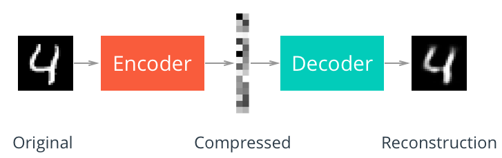

# Autoencoders
Models for compressing data and image denoising.

**Unsupervised learning of efficient codings**

Network tries to generate it's input data with a narrow hidden layer that serves as a compressed representation of the input data.

Aims to learn a representation (encoding) for a set of data, often for **dimensionality reduction**

Encoder and Decoder are built with neural networks